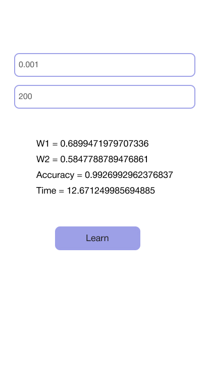

# RTS lab 3.2

### Code

```javascript
const activations = {
  default: (x) => x,
};

class Perceptron {
  weights = [0, 0];
  accuracy = 0;

  threshold = 1;
  learningRate = 0.1;

  activation = activations.default;
  bias = 1;
  error = 1 / 1e6;

  constructor({ threshold, learningRate }) {
    Object.assign(this, { threshold, learningRate });
  }

  guess(point) {
    return this.predict(point) > this.threshold;
  }

  predict(point) {
    return this.activation(this.sum(point));
  }

  train(points) {
    let success = true;
    points.forEach((point, i) => {
      success = this.adjustWeights(point, i) && success;
    });

    return success;
  }

  learn(points, deadline = 100) {
    while (true) {
      if (deadline / points.length <= 0 || this.train(points)) break;
      deadline--;
    }

    return [
      `W1 = ${this.weights[0]} \nW2= ${this.weights[1]} \nAccuracy = ${this.accuracy}`,
    ];
  }

  adjustWeights(point, i) {
    const delta = this.delta(this.predict(point));

    if (Math.abs(delta) < this.error || delta * Math.pow(-1, i) < 0)
      return true;

    this.weights = this.weights.map((w, i) => {
      return w + delta * point[i] * this.learningRate;
    });

    this.accuracy = 1 - delta;

    return false;
  }

  sum(point) {
    return (
      point.reduce((sum, x, i) => sum + x * this.weights[i], 0) + this.bias
    );
  }

  delta(y) {
    return this.threshold - y;
  }
}

export default Perceptron;
```

### Screenshots


