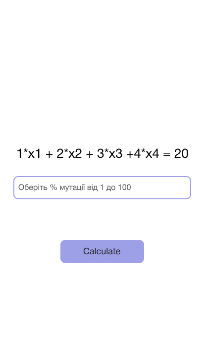
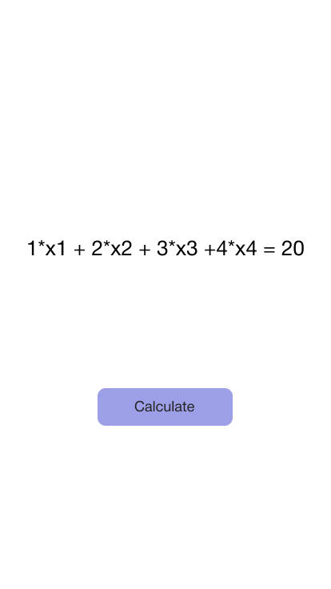
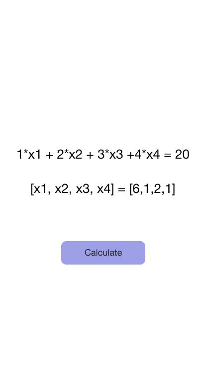

# RTS lab 3.3

### Task screenshot



### Code

```javascript
const random = (min, max) => ~~(Math.random() * (max - min) + min)

class Chromosome {
    genes = [];
    fitness = Infinity;
    task = [];
    target = 0;

    calc = () =>
        this.genes.reduce((a, gene, i) => a + (gene * this.task[i]))

    constructor({ genes, task, target }) {
        Object.assign(this, { genes, task, target });
        this.calcFitness();
    }

    crossover(partner) {
        const child = this.clone();
        const fromParent = child.genes.length / 2;
        child.genes = [...child.genes.slice(0, fromParent), ...partner.genes.slice(child.genes.length - fromParent)];
        child.calcFitness();

        return child
    }

    calcFitness() {
        this.fitness = Math.abs(this.target - this.calc());
    }

    clone() {
        return Object.assign(Object.create(Object.getPrototypeOf(this)), this);
    }
}

let start = performance.now();
class Genetic {
    population = []
    constructor(task, target) {
        const { length } = task
        this.population =
            Array.from(
                { length: length + 1 },
                () => new Chromosome({
                    genes: Array.from({ length }, () => random(1, target / 2)),
                    task: task,
                    target: target,
                })
            )
    }

    solve() {
        while (true) {
            const chromosome = this.crossover()
            if (chromosome)
                return chromosome.genes
        }
    }

    crossover() {
        const children = []
        for (let i = 0; i < this.population.length; i++) {
            const parents = this.population
                .map((chromosome) => ({ chromosome, probability: Math.random() * (chromosome.fitness * 1000) }))
                .sort((a, b) => a.probability - b.probability)

            const parent = parents[0].chromosome
            const partner = parents[1].chromosome
            const child = parent.crossover(partner)

            if (child.fitness === 0)
                return child

            children.push(child)
        }

        this.population = children
    }
}
let end = performance.now()
let res = start - end;
console.log(res);

export default Genetic;
```

### Screenshots



